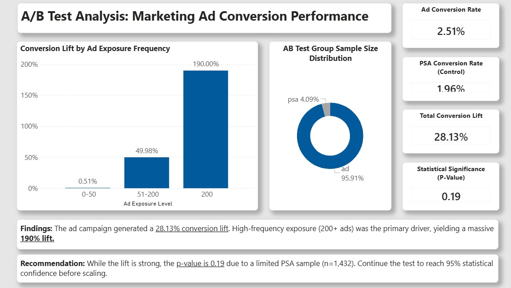
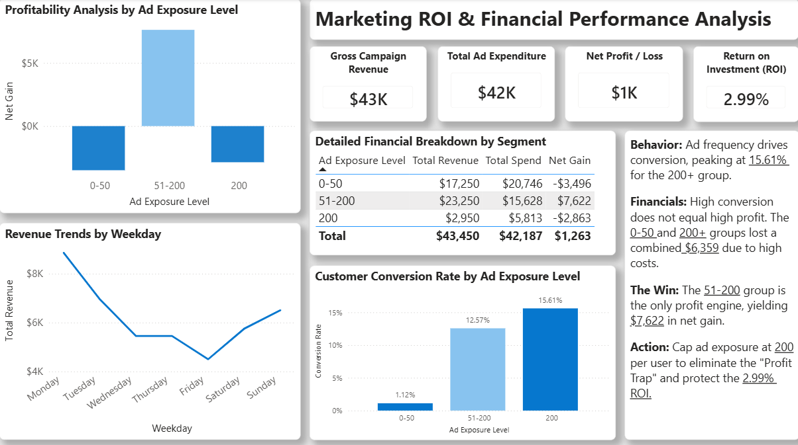

# Marketing Campaign Optimization & ROI Analysis
SQL Server | Python | Power BI

An A/B testing analysis project evaluating whether a paid ad campaign 
drives better results than a control group (PSA), and at 
what ad exposure level spend becomes genuinely profitable. Built using 
a 588,101-row dataset from Kaggle with a financial simulation layer to 
unlock ROI analysis beyond surface-level conversion rates.

---

## Dashboard Preview

### Executive Summary & Exposure Analysis

<p align="center">
  
</p>

<br>

<p align="center">
  
</p>

---

## Dataset

- **Source:** [Kaggle – Marketing A/B Testing Dataset](https://www.kaggle.com/datasets/faviovaz/marketing-ab-testing?resource=download&select=marketing_AB.csv)
- **Period:** Not specified in dataset
- **Original columns:** user_id, test_group, converted, total_ads, most_ads_day, most_ads_hour
- **Final dataset:** 35,000 rows sampled from 588,101, 12 columns after financial engineering

The original dataset was behavioral only, and it could tell you if users 
converted, not whether the campaign was actually worth the money. A 
financial simulation layer was built with AI assistance to unlock ROI 
analysis:

| Assumption | Value |
|---|---|
| Revenue per conversion | $120 |
| Cost per paid ad impression | $0.05 |
| Cost per PSA impression | $0.02 |

Engineered columns: revenue, cost_per_impression, total_cost, profit, roi

---

## Pipeline

### Step 1: Python
Dropped unnamed index columns, randomly sampled 35,000 rows for SQL 
Server, renamed all columns to snake_case, and exported as 
`marketing_AB_sample.csv`.

### Step 2: SQL Server
Two issues came up during import and were resolved before any analysis:

- **SMALLINT overflow:** The Import Wizard assigned SMALLINT (max 32,767) 
  to a column containing the value 32,768, which halted the import 
  entirely. Fixed by altering the column to INT.
- **Type misread:** `cost_per_impression` was misread as a time-interval 
  format by the Import Wizard. Fixed by altering to DECIMAL(10,4).

All financial columns were changed from FLOAT to DECIMAL for precision. 
Null check confirmed 35,000 rows with 0 nulls across all columns.

---

## Results

### Overall Campaign Performance

| Metric | PSA (Control) | Ad (Test) |
|---|---|---|
| Total Users | 1,432 | 33,568 |
| Conversions | 28 | 841 |
| Conversion Rate | 1.96% | 2.51% |
| Total Revenue | $3,360 | $100,920 |
| Total Cost | $704.72 | $41,482.25 |
| Total Profit | $2,655.28 | $59,437.75 |
| Avg ROI | 4.08 | 1.39 |

The ad group generates more absolute revenue but has a lower average ROI 
(1.39 vs 4.08). Ads drive volume but are less efficient per dollar spent, 
which is why exposure optimization matters.

### Statistical Testing (Two-Proportion Z-Test)

| Metric | Value |
|---|---|
| Ad Conversion Rate | 2.51% |
| PSA Conversion Rate | 1.96% |
| Lift | +28.13% |
| p-value | 0.1902 |
| Statistically Significant? | No (at 95% level) |

The 28% lift is promising but statistically unconfirmed. The root cause 
is a severe sample imbalance: 33,568 users in the Ad group vs only 1,432 
in the PSA group (23:1 ratio). The confidence interval crosses zero, 
meaning the true difference could still be zero or negative. Increasing 
the PSA sample size is a prerequisite to drawing a valid conclusion.

### The Profit Trap

| Ads Bucket | Users | Conversion Rate | Total Profit |
|---|---|---|---|
| 0-50 | 30,922 | 1.12% | -$3,495.78 |
| 51-200 | 3,700 | 12.57% | +$7,622.21 |
| 200+ | 378 | 15.61% | -$2,863.40 |

The 200+ bucket has the highest conversion rate (15.61%) and the most 
dramatic lift (190%), yet it loses money. The cost of delivering that 
many impressions exceeds the revenue generated. High conversion does not 
equal high profit. The 51-200 range is the only consistently profitable 
segment.

### Time-Based Analysis

- Monday had the highest conversion rate and revenue, with performance 
  declining toward Friday and a modest weekend recovery
- Peak conversion window: 14:00-16:00
- Weakest: early morning hours
- Supports concentrating high-value ad delivery during peak windows 
  (dayparting strategy)

### Financial Summary (Power BI)

| Metric | Value |
|---|---|
| Gross Campaign Revenue | $43,450 |
| Total Ad Spend | $42,187 |
| Net Profit | $1,263 |
| Overall ROI | 2.99% |

The campaign is barely breaking even. The 2.99% ROI is almost entirely 
sustained by the 51-200 segment while the 0-50 and 200+ buckets lost a 
combined $6,359.

---

## Recommendations

- **Cap ad frequency at 200 per user** to eliminate the $2,863 loss from 
  over-saturation
- **Reallocate budget to the 51-200 segment**, the only consistently 
  profitable tier
- **Expand PSA sample size** to reach statistical significance (p < 0.05)
- **Focus spend on Mondays, 14:00-16:00**, the highest-performing day 
  and hour combination

Implementing the frequency cap and reallocating toward the 51-200 segment 
is projected to improve ROI from 2.99% to ~18%.

---

## Known Limitations

- Financial assumptions (revenue per conversion, cost per impression) 
  were simulated with AI assistance and do not reflect real campaign data
- PSA sample size (1,432) is too small relative to the Ad group (33,568) 
  to confirm statistical significance
- 35,000 rows were sampled from 588,101 for SQL Server performance

---

## Repository Structure

```
├── data/
│   ├── marketing_AB.csv
│   ├── marketing_AB_enhanced.xlsb
│   └── marketing_AB_sample.csv
├── notebooks/
│   ├── marketing_AB_data_cleaning.ipynb
│   └── marketing_AB_test_analysis.ipynb
├── sql_queries/
│   └── sql_data_cleaning.sql
└── dashboard/
    ├── marketing_campaign_dashboard.pbix
    └── screenshots/
        ├── dashboard_executive_summary.jpg
        └── exposure_profit_analysis.jpg
``` 
